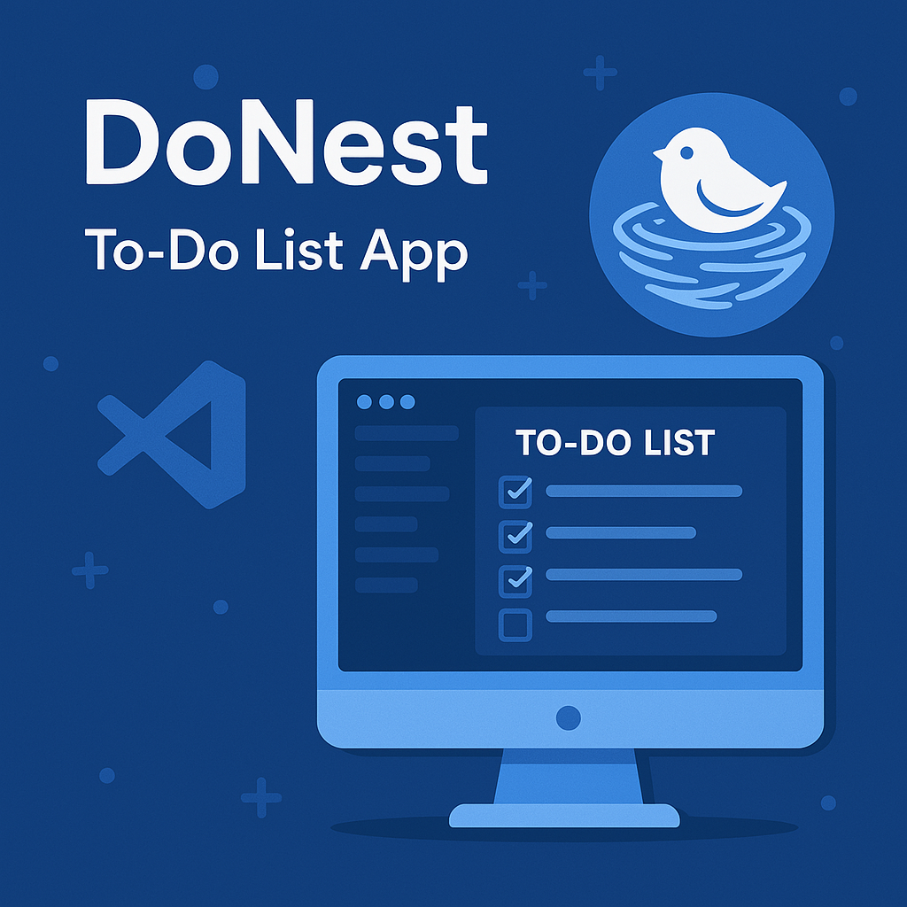
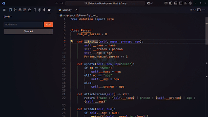
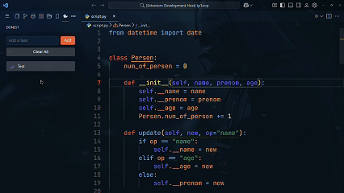
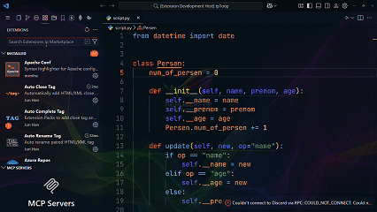

# DoNest 📝

A modern, elegant task management extension for Visual Studio Code.

## ✨ Preview

### 🎯 Task Management

### 📝 Quick Editing

### 🗑️ Batch Operations

## ✨ Overview

DoNest transforms your VS Code workspace into a powerful task management environment. With its sleek, modern UI and intuitive controls, you can efficiently manage your tasks without ever leaving your editor. Perfect for developers who want to keep their workflow streamlined and organized.

## 🎬 Features in Action

📋 Task Creation and Management

- One-click task creation
- Automatic file linking
- Smart task organization

✏️ Edit and Update

- Quick rename functionality
- Instant updates
- Smooth animations

🗂️ File Navigation

- Click to open files
- Smart file tracking
- Quick workspace navigation

## 🚀 Key Features

### 💫 Modern User Interface

- **Theme-Aware Design**: Seamlessly adapts to your VS Code theme
- **Responsive Layout**: Perfect display on any window size
- **Intuitive Controls**: Easy-to-use buttons and inputs
- **Visual Feedback**: Smooth animations and hover effects

### 📋 Task Management

- **Smart Task Creation**: Add tasks with automatic file linking
- **Quick Actions**: Edit, delete, or clear tasks with a click
- **Batch Operations**: Manage multiple tasks efficiently
- **File Association**: Tasks are linked to specific files for context

### ⚡ Quick Access

- **Sidebar Integration**: Access tasks from the Activity Bar
- **Command Palette**: Full keyboard control support
- **One-Click Navigation**: Jump to task-related files instantly
- **Smart Search**: Find tasks quickly with the quick pick menu

### 1️⃣ Getting Started

1. Install DoNest from the VS Code Marketplace
2. Click the DoNest icon in the Activity Bar
3. Start adding tasks to your workspace!

### 2️⃣ Task Operations

#### Creating Tasks

- Use the input field at the top
- Press Enter or click 'Add'
- Tasks are automatically linked to the active file

#### Managing Tasks

- **Edit**: Click the ✏️ button
- **Delete**: Click the ❌ button
- **Navigate**: Click the task text
- **Clear All**: Use the 'Clear All' button

### 3️⃣ Command Palette Integration

Access all features through the Command Palette (`Ctrl+Shift+P` / `Cmd+Shift+P`):

| Command                  | Description            |
| ------------------------ | ---------------------- |
| \`DoNest: Add Todo\`     | Create a new task      |
| \`DoNest: Show Todos\`   | View all tasks         |
| \`DoNest: Remove Todos\` | Delete specific tasks  |
| \`DoNest: Clear Todos\`  | Remove all tasks       |
| \`DoNest: Select Todos\` | Navigate to task files |
| \`DoNest: Rename Todos\` | Modify task names      |

## 💻 Requirements

- Visual Studio Code version 1.60.0 or higher
- Active workspace with saved files

## 🛠️ Installation

1. Open VS Code
2. Press `Ctrl+P` / `Cmd+P`
3. Type: `ext install oussamabenalisst.donest`

## 🤝 Support & Feedback

We love hearing from our users! If you have:

- 🐛 Found a bug
- 💡 Feature suggestion
- 👋 General feedback

Visit our [GitHub repository](https://github.com/oussamabenalisst/DoNest) to:

- Create an issue
- Submit a pull request
- Join the discussion

---

If you find DoNest helpful, please consider giving it a ⭐ on [GitHub](https://github.com/oussamabenalisst/DoNest)!

